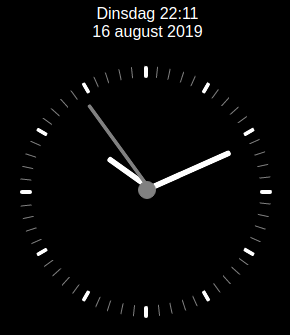

# lovelace-clock
clock card for my lovelace dashboard

installing: 

place the the file clock.html in the www folder.

add the following in your ui-lovelace.yaml

    cards:
     - type: iframe
       url: /local/clock.html
       aspect_ratio: 110% # tweak this to get it to fit right
